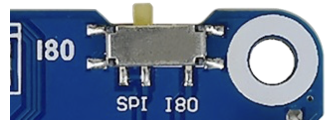
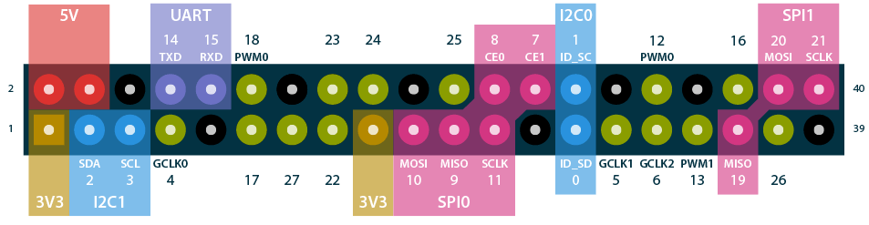
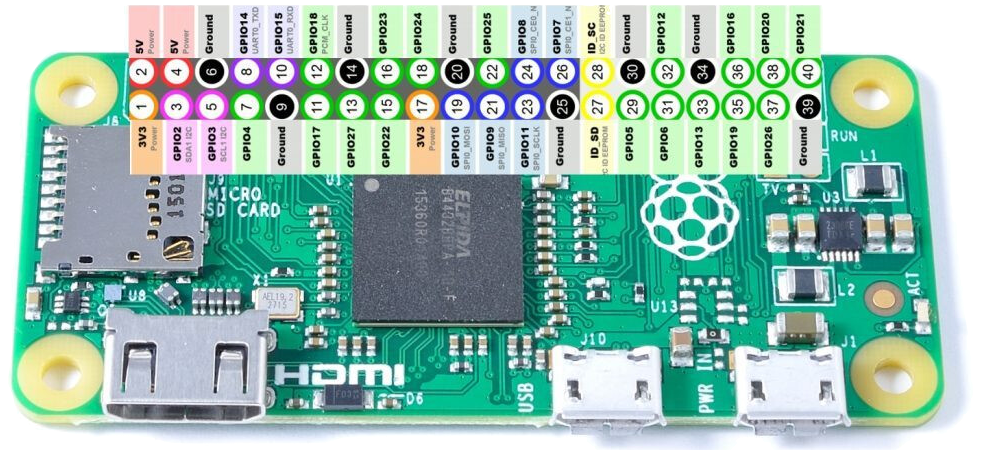

# Fancy e-paper photo frame

### A project to build a nice 13.3-inch 6-color e-paper picture frame that updates once a day.

* [Overview](../README.md)
* [Materials List](materials.md)
* [Construction And Wiring](construction.md)
* [Software](software.md)

# Construction:

The core of this project is a Raspberry Pi Zero 2WH computer.  Get one, and tear open the box!

<a data-flickr-embed="true" href="https://www.flickr.com/photos/57897385@N07/54370809032/in/dateposted/" title="2025-02-11-173800-IMG_5949"></a>

### Install an OS on the Raspberry Pi

The easiest way to do this by far is with the [Raspberry Pi OS imager](https://www.raspberrypi.com/software/) app.  Install it on your computer, then plug in a microSD card (you may need an adaptor) and launch the application.

I told the app to make a full-featured installation, because with a 16GB media card, why not?  I gave the device the name "pictureframe", and pre-configured it with a running SSH server and credentials to join my local wifi network.

Super-duper easy.  When I plugged the card into the Pi and started it up, it appeared on the local network about a minute later.  Then all I had to do was run `ssh pictureframe.local -l USERNAME` from my computer to log in for the first time.

### Pi can't connect to an unfamiliar wifi? Fix it with the PiUART!

Before we proceed, let's establish a way to connect to the Pi that will work even if the wifi chip is off or there are no known networks around.

<a data-flickr-embed="true" href="https://www.flickr.com/photos/57897385@N07/54371920663/in/dateposted/" title="2025-02-11-191206-IMG_5954"></a>

With the PiUART, you can power and communicate with the Pi directly from a USB port on your computer.

For MacOS, you'll need to enable a serial port in the operating system, which means running some commands to disable "system integrity protection".  If you'd rather not do that, do what I did and use an older version of MacOS in the [UTM emulator](https://github.com/utmapp/UTM/releases).  I had MacOS 10.9 (Mavericks) sitting around, so I used that, and told UTM to just grab the PiUART device directly.

The command to connect to the Pi from there is `screen /dev/cu.SLAB_USBtoUART 115200` and if you'd like to do this in a proper terminal (rather than Apple's plain Terminal app) you can grab an old version of [iTerm](https://iterm2.com/downloads.html).  Set the reported terminal type as "xterm" if you plan to use any fancy semi-GUI stuff.  Hit "enter" a few times after you run the command to wake up the port on the Pi side.

#### How to get your wifi back

All that stuff online about editing `/etc/wpa_supplicant/wpa_supplicant.conf` files no longer applies to the latest OS.  Instead, once you're connected, you can run the `sudo nmtui` command.

(If the interface looks like garbage, make sure you're reporting the terminal as "xterm" in iTerm.)

You can also add and remove known networks directly from the command line.

To add a network from the command line (will auto-join immediately after it's added)

```bash
sudo nmcli con add con-name NETWORKNAME type wifi ssid NETWORKNAME autoconnect yes save yes wifi-sec.key-mgmt wpa-psk wifi-sec.psk NETWORKPASSWORD
```

To remove a network you added
```bash
sudo nmcli con delete NETWORKNAME
```
To list the current known network profiles
```bash
sudo nmcli con
```

### It boots! Now what?

At this point you can try installing the PiSugar 3 through the conventional means, by mounting it to the underside of the Raspberry Pi, like so:

<a data-flickr-embed="true" href="https://www.flickr.com/photos/57897385@N07/54371682246/in/dateposted/" title="2025-02-11-200318-IMG_E5959"></a>

This works great of course, but it makes a stack of hardware that's too tall for fitting behind a picture frame.

There are two great things about the PiSugar 3 that help here:  First, you can un-stick the battery from the board.  In fact, you can just go ahead and peel off the magnet from the battery and stick it on your fridge instead, because we ain't using it.

The other great thing about the PiSugar 3 is this header:

<a data-flickr-embed="true" href="https://www.flickr.com/photos/57897385@N07/54372078080/in/dateposted/" title="2025-02-23-223319-IMG_6031"></a>

You know that [6-pin Molex Connector Cable, 1.25mm pitch](https://www.adafruit.com/product/4926) from the parts list?  It plugs right into that.  And you only need to connect four of the wires coming off it to the Raspberry Pi to get all the same functionality that you would if you installed the board the normal way.

Since we're on the subject of connectors, here are the accessories that come with the 13.3-inch e-paper display:

<a data-flickr-embed="true" href="https://www.flickr.com/photos/57897385@N07/54372078340/in/dateposted/" title="2025-02-17-163754-IMG_5997"></a>

See that connector cable near the top?  That plugs into the driver board included with the display, and can be used to connect the Raspbery Pi instead of piggybacking it on that giant GPIO header.

Here's a demonstration of this working, using a [mini black hat hack3r](https://shop.pimoroni.com/products/mini-black-hat-hack3r?variant=19448025991) board and some jumper wires:

<a data-flickr-embed="true" href="https://www.flickr.com/photos/57897385@N07/54371682401/in/dateposted/" title="2025-02-17-192046-IMG_6005"></a>

Now, a couple of the wires used by the e-paper driver board overlap with the PiSugar 3.  You're going to need four of those small crimp-on connectors to join them together when you wire everything up:

<a data-flickr-embed="true" href="https://www.flickr.com/photos/57897385@N07/54371888739/in/dateposted/" title="2025-02-23-231851-IMG_6033"></a>

But this is honestly a small price to pay, to get rid of all those big ribbon cables, and eliminate any need to stack hardware.

Here's the configuration with the [mini black hat hack3r](https://shop.pimoroni.com/products/mini-black-hat-hack3r?variant=19448025991) factored out:

<a data-flickr-embed="true" href="https://www.flickr.com/photos/57897385@N07/54370809477/in/dateposted/" title="2025-02-24-075112-IMG_E6037"></a>

This is the hardware as it will be assembled into the frame.

When the frame arrives from [Frame-It-Easy](https://www.frameiteasy.com/frame-styles/ashford?cid=1), it will be quite thoroughly packaged:

<a data-flickr-embed="true" href="https://www.flickr.com/photos/57897385@N07/54372077830/in/dateposted/" title="2025-03-05-203037-IMG_6085"></a>

Separate the mat (the rectangular paper window that goes around the art) from the frame and lay it face down, and tape the display to the back of it.

<a data-flickr-embed="true" href="https://www.flickr.com/photos/57897385@N07/54372078195/in/dateposted/" title="2025-03-05-211325-IMG_6091"></a>

When I did this, I had the measurements slightly wrong: 8 1/2&quot; x 6 1/2&quot; instead of 8 3/4&quot; x 6 3/4&quot;, so I had to cut some material off the inside of the mat.  That's why mine looks a bit torn up.  Yours won't.  My pain is your gain!

Next, get the backing material out, because you're going to savage it with the x-acto knife:

<a data-flickr-embed="true" href="https://www.flickr.com/photos/57897385@N07/54371682836/in/dateposted/" title="2025-03-05-211738-IMG_6092"></a>

Use a pencil to make marks in the shape of a slot, wide enough to fit the majority of the large ribbon cable through.  Cut from the underside -- it's a bit easier.

<a data-flickr-embed="true" href="https://www.flickr.com/photos/57897385@N07/54371918813/in/dateposted/" title="2025-03-05-203606-IMG_6088"></a>

At this point you're ready to assemble the frame.  Take my advice and make very sure that you wipe the dust off the display, the mat, and the plexiglass.  Dust is _sneaky!_

<a data-flickr-embed="true" href="https://www.flickr.com/photos/57897385@N07/54371683071/in/dateposted/" title="2025-03-05-213209-IMG_6094"></a>

With a one-inch mat, there is enough space to pass the cable through without hitting the inside of the metal frame, and enough slack on the end to bend it around so it faces the other direction.

From there you can attach the little adaptor board, and then use some velcro to stick it to the backing.

<a data-flickr-embed="true" href="https://www.flickr.com/photos/57897385@N07/54370809207/in/dateposted/" title="2025-03-06-174715-IMG_E6106"></a>

You could potentially assemble everything right now and just roll with it.  But if you do, you'll notice how much that connector on the driver board sticks out...

<a data-flickr-embed="true" href="https://www.flickr.com/photos/57897385@N07/54371920798/in/dateposted/" title="2025-03-05-214029-IMG_6095"></a>

If you're feeling brave, now is the time to break out the Dremel tool and do something risky.

<a data-flickr-embed="true" href="https://www.flickr.com/photos/57897385@N07/54371920748/in/dateposted/" title="2025-03-06-164514-IMG_E6103"></a>

Put on some gloves and safety goggles.  Go outside and pour some water on the pavement.  This is so the metal bits will stick to it, until you can wipe them up with a few paper towels.

Then start carving!  Whooo!!

<a data-flickr-embed="true" href="https://www.flickr.com/photos/57897385@N07/54371920743/in/dateposted/" title="2025-03-06-165535-IMG_E6104"></a>

This socket sticks up a lot, and you don't need it at all.  Carve that sucker down.  Chop the pins off the connector on the other side too, if you feel like it.

One more thing for saving space:  You only need to attach twelve wires to twelve pins on the Raspberry Pi.  Feel free to bend them down.

<a data-flickr-embed="true" href="https://www.flickr.com/photos/57897385@N07/54372076420/in/dateposted/" title="2025-02-25-233332-IMG_6044"></a>

And that's all it takes to assemble this project.

### Wiring

This is definitely the trickiest part of the project.

Some initial advice:  Make sure your display board is in SPI mode, because we're going to be using the SPI port.  Check for a switch on it!



The diagram below shows what connections to make with your jumper wires.  Note there are four places where you'll need to join wires with the crimping tool.  Two of those places involve joining four wires.


I found these two diagrams helpful while I figured this out.  These are two alternate ways of labeling the IO port on your Raspberry Pi.  The first is known as "BCM numbering".





Continue to:

# [Software](software.md)

